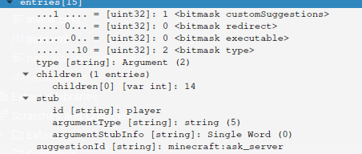

# Reproduction Command Argument Autocompletion

## TL;DR

The server does not execute the callback for the autocomplete of a custom command argument.

Run with `./mvnw compile exec:java` (requires Java 21).


## Why?

I asked the following question on the [minestom discord](https://discord.gg/faDaHtpykW) server and got asked
to build a reproduction for the issue.

> Hey y'all,
>I'm trying to build a custom command argument but autocomplete is not working.
>
>When I'm trying to do autocomplete, my server doesn't execute the callback, see the code below for clarification.
>I think, the command packet output should be correct for server-side autocomplete.

```kt
class OfflinePlayerArgument(id: String) : Argument<OfflinePlayer>(id, false) {
init {
setSuggestionCallback(Companion)
}

    override fun parse(sender: CommandSender, input: String): OrionPlayer {
        val player = OfflinePlayerProvider.getOrNull(input)
        if (player == null) {
            throw ArgumentSyntaxException("Player not found", input, 1)
        } else {
            return player
        }
    }

    override fun parser(): String = "brigadier:string"
    override fun nodeProperties(): ByteArray? {
        return BinaryWriter.makeArray { packetWriter: BinaryWriter ->
            packetWriter.writeVarInt(1)
        }
    }

    companion object : SuggestionCallback {
        private var allPlayers = OfflinePlayerProvider.loadUsernames()
        private var lastRefresh = System.currentTimeMillis()

        override fun apply(sender: CommandSender, context: CommandContext, suggestion: Suggestion) {
            println("THIS IS NOT PRINTED")
            refresh()

            val onlinePlayers = Mc.connection.onlinePlayers.map { it.username }
            val allPlayersButOnlineOnTop =
                allPlayers.filter { it !in onlinePlayers } + allPlayers.filter { it in onlinePlayers }

            allPlayersButOnlineOnTop.forEach {
                suggestion.addEntry(SuggestionEntry(it))
            }
        }

        private fun refresh() {
            if (System.currentTimeMillis() - lastRefresh > 180000) {
                allPlayers = OfflinePlayerProvider.loadUsernames()
                lastRefresh = System.currentTimeMillis()
            }
        }
    }
}
```

